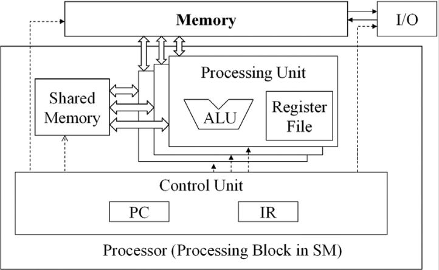
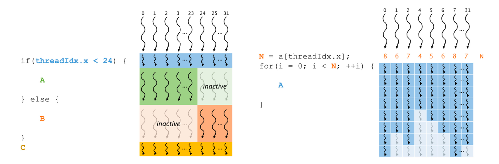

# How GPU Computing Works | GTC 2021
- The compute ratio: max FLOPS / Memory BW.
    - How many ops you need to
be doing to
make sure processing units 
are not idle.

- The GPU is a throughput 
machine: you have many more 
threads available than 
dictated by compute ratio and DRAM memory latency

- The number of registers you have dictates the number of threads you can run.

- GPUs have large register count that have higher latency than CPU

- Moving data across the 
PCI bus is 3x as very slow 
one of biggest bottleneck

- NVlink is closer to HBM latency than PCIe!


- A100 - 108 S streaming multiprocessor.

    Each SM: 64 warps/SM.

    In each clock cycle, you have 4 warps doing something.

- The GPU can switch between 
warps back-to-back.
- Essentially zero cost of context 
switch.
- It's important to have 
more threads than you can 
run.

- GPU vs CPU is like Train vs Car
    - Trains being full as essential
    - It's good to have people
    waiting at the station.
    - Oversubscription means 
    keeping the GPU busy.
    - GPU/CPU asynchrony is 
    essential.

- Matmul has an arithmetic
intensity of O(N).


- **Tensor Cores**: Custom hardware units built into the SM. They can do a matrix multiplication in one go.
    - FMA does 2 FLOPs per instruction. Tensor cores do way more.
    - You need a much bigger matrix to match compute intensity.


# How CUDA Programming Works | GTC 2022
- FLOPS don't matter (for most cases). Look at memory bandwidth.
- A100: 1555 GB / sec (HBM2 memory bandwidth)
- Each Sm in A100 can request 64 Bytes per clock cycle
- Ratio of B/W requested / provided =  9750 / 1555 = 6.3x
- Random Access Memory: 
    - Row decoder and column decoder. Activate ro w and pull data in to sense amplifiers. This destroys data in the row as capacitors drain.
    - Column decoder will read from the sense amplifier and you can read repeatedly from the sense amplifier because they can hold their voltage.
    - You can use this in "burst" mode. 
    - Before a new row(page) is fetched, you have a write back step since the sense amplifier has to restore the state of the capacitors. 
    - You are limited by physics with data reading: youcan only read as fasts as you can charge capacitors back up, etc.
- Memory access pattern matters for memory bandwidth:
    - With the largeest stride size between two reads, you get a speed of 111 GB/sec vs 1418 GB/sec (only 8% of peak bandwidth)
    - Thus, the biggest optimization you can do is handling memory access patterns. No other optimization comes close.
- "The reason you're using a GPU is for performance. High performance means being able to use all the GPU resources you can, which means paying attention to memory access patterns"

# PMPP Book
## Chapter 2


- CPUs are designed to minimize the latency of instruction execution while GPUs are designed to maximize the throughput of executing instructions.
- BUilt-in variables accessible by threads: “threadIdx,” “blockIdx,”, "gridDim", “blockDim.”
    - Can be multidimensional when dealing with multidimensional data.
    - Recall that CUDA is meant fo SIMD processing - so you'd use as many dimensions as needed by your data.
- The execution configuration parameters are given between the “<<<” and “>>>” (triple chevrons)
- CUDA code has a number of extensions to C. Thus, it can only be compiled by a compiler like NVCC.
- The host code gets compiled with the host's standard C/C++ compilers, while the device code, which is marked with CUDA keywords that designate CUDA kernels and their associated helper functions and data structures, is compiled by NVCC into virtual binary files called PTX files.

## Chapter 3
- A grid is a three-dimensional (3D) array of blocks, and each block is a 3D array of threads. 
- Execution parameters: Say <<<256, 128>>>> The first execution configuration parameter specifies the dimensions of the grid in number of blocks (256 blocks), while the second specifies dimensions of each block in number of threads. Each parameter has the type `dim3`.
- You can do stuff like 

```
dim3 dimGrid(32, 1, 1); 
dim3 dimBlock(128, 1, 1); 
myKernel<<<dimGrid, dimBlock>>>(arg1, arg2...)
```
- The syntax for 1D blocks and grids is special -  you can just provide the value for that dimension like above.    
- ONe small problem with multidimensional (take 2D here) arrays - CUDA C is based on classic ANSI C, where you need to know the number of columns beforehand i.e at compile time. However, with dynamically allocated arrays, what we're looking for is this flexibility in not specifying number of columns. Thus, we rely on single-dimensional indexing and CUDA leaves the translation of 2D / n-D indices into the 1D equivalent to the programmers. 
    - TL;DR: In your CUDA code, you'll need to always use the linearized 1D index for your n-D arrays.

## Chapter 4
- This one's all about the GPU architecture and reasoning about CUDA code performance.


- Each Streaming Multiprocessor(SM) has several processing units called streaming processors or CUDA cores. 
- When a grid of threads is launched,  threads are assigned to a given SM block by block. CUDA ensures that an entire block is assigned to only one SM. Note that multiple blocks can still be assigned to the same SM. 
- Threads in the same block can interact with each other in special ways - through barrier synchronization and through shared memory. 

### Barrier synchronization
- CUDA provides a special `__syncthreads()` function which enables threads in the same block to sync with each other after performing some computations. It helps to coordinate parallel activities in a block.
- If a `__syncthreads()` statement is present, it MUST be executed by ALL threads in a block. A `__syncthreads()` statement on Line 10 will be different from one on Line 20. Thus, if you use `__syncthreads()` in a if-then-else block, then the conditions of that if statement must resolve to the same value for ALL threads in a block. Otherwise, you might have a deadlock or other undefined behaviour.
- Not only are all the threads in a block assigned to the same SM, they are assigned simulaneously.
- Different blocks of threads can be executed in any order, each on any SM. You cannot synchronize across blocks!
- The CUDA runtime system can thus execute a grid of blocks at different speeds! This can be dictated by cost, power and performance requirements. 
### Warps and SIMD hardware 
- This concerns *thread scheduling* - how are threads in a block executed at a hardware level?
- Each block is divided into 32-thread units called *warps*.
- If the block size is not divisible by 32, then the block is padded with inactive threads.
- Each SM is divided into *processing blocks*, where a group of (say) 8 cores share the same instruction fetch/dispatch unit. Threads in the same warp are assigned to the same processing block (or blocks), which fetch the instruction for the warp and the cores execute that instruction for all the threads in a warp. (SIMD)
- One advantage of SIMD is that the cost of the control hardware (eg. instruction fetch/dispatch unit) is shared across multiple processing units (cores).
- When you think about instruction execution, you should imagine *warps*, not *threads* -  the same instruction is executed for a group of threads. So for example, if a global memory access is needed, then the entire warp is waiting for data for all the 32 threads.

 
*Figure depicts a modified von Neumann archictecture for the Single-Instruction-Multiple-Data mode used in GPUs. The Control Unit loads the same instruction such as `add r1, r2, r3` for all the different processing units. The difference between processing units is that the registers contain different data.*

### Control divergence

- Sometimes there can be control statements in your CUDA kernel that can lead to different execution paths for different threads. Ex: `if(threadIdx.x < 20)`
- When threads within a warp have different execution paths - that is, when they exhibit *control divergence* -  then the threads are executed by hardware in multiple passes. For a simple `if` condition like above, this would be two passes as shown in the figure. 
- This additional time is overhead that can be very costly depending on the % of control divergence seen for the given data. 
- When you have control divergence in a for loop, some threads can become inactive while others continue until all finish.
- One reason for using a control construct (like an if condition) that shows control divergence: boundary conditions with data. 
- Data size might not be divisible by block size, and thus you need a guard (`if(x < n)`) to ensure correctness. Some threads launched will thus be inactive (yet there will be two passes by the hardware. This is why data size will determine how much of an impact this has.)

 

### Warp scheduling and latency tolerance
- Each SM is assigned more warps than it can process at a given instant.
- When a warp is waiting for a (previously initiated) long-latency operation, like a global memory read, then it is not scheduled and the processing block switches to another warp that is ready to be executed.
- This mechanism of filling up long latency operations by switching to other threads is called *latency tolerance*.
- The switching between warps in fact introduces no overhead since the execution states for all the warps are already stored in the hardware registers. This is *zero-overhead switching*. Constrast this to the *context switching* in the classic von Neumann processor. Here, the state of the control unit for the current process has to be saved and the state for the next process has to be loaded which can introduce additional overhead.

### Resource partitioning and occupancy
- $ \text{Occupancy} = \dfrac{\text{Number of warps assigned}}{\text{Maximum number of warps supported}}$
- Occupancy can vary because of how execution resources of an SM are *partitioned*. Execution resources include registers, shared memory, thread block slots and thread slots.
- Consider the A100 GPU. Each SM has a maximum of 32 blocks per SM, 64 warps (2048 threads) per SM. What if the block size is 768? Then the number of blocks an SM can handle is 2 (1536 threads). This means that the occupancy is 1536/2048 = 75\%.
- There are register resource limitations on occupancy.For an A100, there is a maximum of 65,536 registers per SM. Thus, each thread cannot use more than (65536/2048)= 32 registers for maximum occupancy. But, if each thread needs, say, 64 registers, then you can never achieve maximum occupancy, regardless of block size, etc. the CUDA compiler can perform register spilling to reduce the requirements per thread, but this is at the cost of latency.
- There's a [CUDA Occupancy Calculator from NVIDIA](https://developer.download.nvidia.com/compute/cuda/4_0/sdk/docs/CUDA_Occupancy_Calculator.xls) that can help calculate the actual number of threads per SM. This is a bit old now though so it might not work for the latest CUDA versions.
- The amount of resources in each CUDA device SM is mentioned as a part of the *compute capability* of the device. Even seen the number "compute capability 8.0", etc? This is what that means.