# How GPU Computing Works | GTC 2021
- The compute ratio: max FLOPS / Memory BW.
    - How many ops you need to
be doing to
make sure processing units 
are not idle.

- The GPU is a throughput 
machine: you have many more 
threads available than 
dictated by compute ratio and DRAM memory latency

- The number of registers you have dictates the number of threads you can run.

- GPUs have large register count that have higher latency than CPU

- Moving data across the 
PCI bus is 3x as very slow 
one of biggest bottleneck

- NVlink is closer to HBM latency than PCIe!
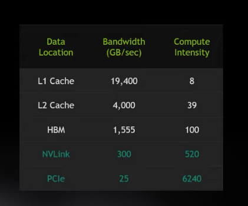

- A100 - 108 S streaming multiprocessor.

    Each SM: 64 warps/SM.

    In each clock cycle, you have 4 warps doing something.

- The GPU can switch between 
warps back-to-back.
- Essentially zero cost of context 
switch.
- It's important to have 
more threads than you can 
run.

- GPU vs CPU is like Train vs Car
    - Trains being full as essential
    - It's good to have people
    waiting at the station.
    - Oversubscription means 
    keeping the GPU busy.
    - GPU/CPU asynchrony is 
    essential.

- Matmul has an arithmetic
intensity of O(N).

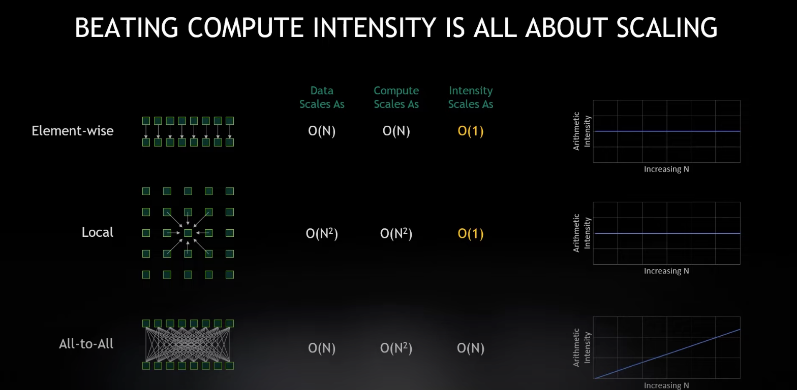

- **Tensor Cores**: Custom hardware units built into the SM. They can do a matrix multiplication in one go.
    - FMA does 2 FLOPs per instruction. Tensor cores do way more.
    - You need a much bigger matrix to match compute intensity.

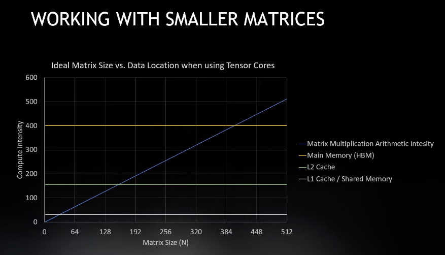

# How CUDA Programming Works | GTC 2022
- FLOPS don't matter (for most cases). Look at memory bandwidth.
- A100: 1555 GB / sec (HBM2 memory bandwidth)
- Each Sm in A100 can request 64 Bytes per clock cycle
- Ratio of B/W requested / provided =  9750 / 1555 = 6.3x
- Random Access Memory: 
    - Row decoder and column decoder. Activate ro w and pull data in to sense amplifiers. This destroys data in the row as capacitors drain.
    - Column decoder will read from the sense amplifier and you can read repeatedly from the sense amplifier because they can hold their voltage.
    - You can use this in "burst" mode. 
    - Before a new row(page) is fetched, you have a write back step since the sense amplifier has to restore the state of the capacitors. 
    - You are limited by physics with data reading: youcan only read as fasts as you can charge capacitors back up, etc.
- Memory access pattern matters for memory bandwidth:
    - With the largeest stride size between two reads, you get a speed of 111 GB/sec vs 1418 GB/sec (only 8% of peak bandwidth)
    - Thus, the biggest optimization you can do is handling memory access patterns. No other optimization comes close.
- "The reason you're using a GPU is for performance. High performance means being able to use all the GPU resources you can, which means paying attention to memory access patterns"

# PMPP Book
## Chapter 2

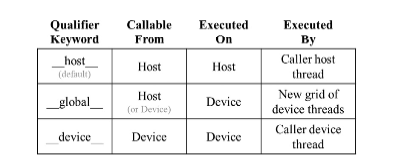
- CPUs are designed to minimize the latency of instruction execution while GPUs are designed to maximize the throughput of executing instructions.
- BUilt-in variables accessible by threads: “threadIdx,” “blockIdx,”, "gridDim", “blockDim.”
    - Can be multidimensional when dealing with multidimensional data.
    - Recall that CUDA is meant fo SIMD processing - so you'd use as many dimensions as needed by your data.
- The execution configuration parameters are given between the “<<<” and “>>>” (triple chevrons)
- CUDA code has a number of extensions to C. Thus, it can only be compiled by a compiler like NVCC.
- The host code gets compiled with the host's standard C/C++ compilers, while the device code, which is marked with CUDA keywords that designate CUDA kernels and their associated helper functions and data structures, is compiled by NVCC into virtual binary files called PTX files.

## Chapter 3
- A grid is a three-dimensional (3D) array of blocks, and each block is a 3D array of threads. 
- Execution parameters: Say <<<256, 128>>>> The first execution configuration parameter specifies the dimensions of the grid in number of blocks (256 blocks), while the second specifies dimensions of each block in number of threads. Each parameter has the type `dim3`.
- You can do stuff like 

```
dim3 dimGrid(32, 1, 1); 
dim3 dimBlock(128, 1, 1); 
myKernel<<<dimGrid, dimBlock>>>(arg1, arg2...)
```
- The syntax for 1D blocks and grids is special -  you can just provide the value for that dimension like above.    
- ONe small problem with multidimensional (take 2D here) arrays - CUDA C is based on classic ANSI C, where you need to know the number of columns beforehand i.e at compile time. However, with dynamically allocated arrays, what we're looking for is this flexibility in not specifying number of columns. Thus, we rely on single-dimensional indexing and CUDA leaves the translation of 2D / n-D indices into the 1D equivalent to the programmers. 
    - TL;DR: In your CUDA code, you'll need to always use the linearized 1D index for your n-D arrays.

## Chapter 4
- This one's all about the GPU architecture and reasoning about CUDA code performance.

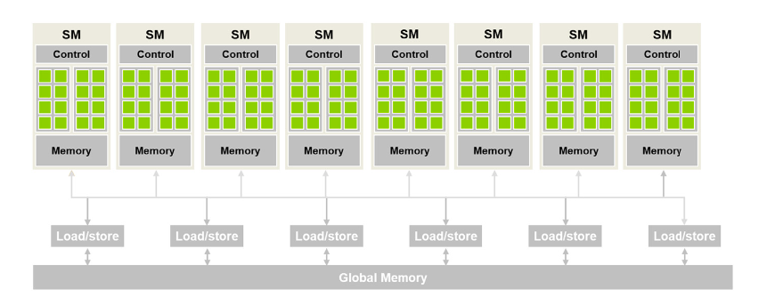

- Each Streaming Multiprocessor(SM) has several processing units called streaming processors or CUDA cores. 
- When a grid of threads is launched,  threads are assigned to a given SM block by block. CUDA ensures that an entire block is assigned to only one SM. Note that multiple blocks can still be assigned to the same SM. 
- Threads in the same block can interact with each other in special ways - through barrier synchronization and through shared memory. 

### Barrier synchronization
- CUDA provides a special `__syncthreads()` function which enables threads in the same block to sync with each other after performing some computations. It helps to coordinate parallel activities in a block.
- If a `__syncthreads()` statement is present, it MUST be executed by ALL threads in a block. A `__syncthreads()` statement on Line 10 will be different from one on Line 20. Thus, if you use `__syncthreads()` in a if-then-else block, then the conditions of that if statement must resolve to the same value for ALL threads in a block. Otherwise, you might have a deadlock or other undefined behaviour.
- Not only are all the threads in a block assigned to the same SM, they are assigned simulaneously.
- Different blocks of threads can be executed in any order, each on any SM. You cannot synchronize across blocks!
- The CUDA runtime system can thus execute a grid of blocks at different speeds! This can be dictated by cost, power and performance requirements. 
### Warps and SIMD hardware 
- This concerns *thread scheduling* - how are threads in a block executed at a hardware level?
- Each block is divided into 32-thread units called *warps*.
- If the block size is not divisible by 32, then the block is padded with inactive threads.
- Each SM is divided into *processing blocks*, where a group of (say) 8 cores share the same instruction fetch/dispatch unit. Threads in the same warp are assigned to the same processing block (or blocks), which fetch the instruction for the warp and the cores execute that instruction for all the threads in a warp. (SIMD)
- One advantage of SIMD is that the cost of the control hardware (eg. instruction fetch/dispatch unit) is shared across multiple processing units (cores).
- When you think about instruction execution, you should imagine *warps*, not *threads* -  the same instruction is executed for a group of threads. So for example, if a global memory access is needed, then the entire warp is waiting for data for all the 32 threads.

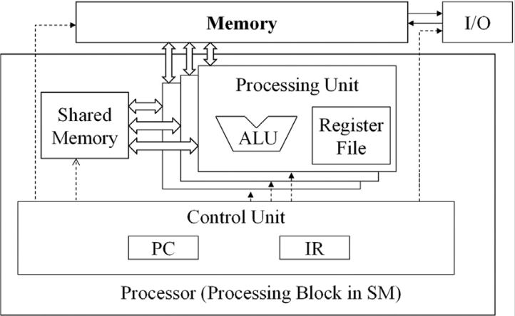 
*Figure depicts a modified von Neumann archictecture for the Single-Instruction-Multiple-Data mode used in GPUs. The Control Unit loads the same instruction such as `add r1, r2, r3` for all the different processing units. The difference between processing units is that the registers contain different data.*

### Control divergence

- Sometimes there can be control statements in your CUDA kernel that can lead to different execution paths for different threads. Ex: `if(threadIdx.x < 20)`
- When threads within a warp have different execution paths - that is, when they exhibit *control divergence* -  then the threads are executed by hardware in multiple passes. For a simple `if` condition like above, this would be two passes as shown in the figure. 
- This additional time is overhead that can be very costly depending on the % of control divergence seen for the given data. 
- When you have control divergence in a for loop, some threads can become inactive while others continue until all finish.
- One reason for using a control construct (like an if condition) that shows control divergence: boundary conditions with data. 
- Data size might not be divisible by block size, and thus you need a guard (`if(x < n)`) to ensure correctness. Some threads launched will thus be inactive (yet there will be two passes by the hardware. This is why data size will determine how much of an impact this has.)

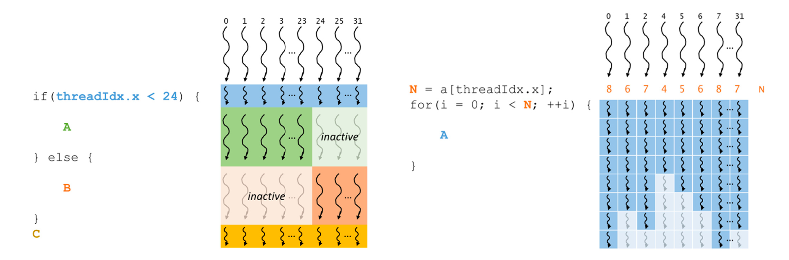 

### Warp scheduling and latency tolerance
- Each SM is assigned more warps than it can process at a given instant.
- When a warp is waiting for a (previously initiated) long-latency operation, like a global memory read, then it is not scheduled and the processing block switches to another warp that is ready to be executed.
- This mechanism of filling up long latency operations by switching to other threads is called *latency tolerance*.
- The switching between warps in fact introduces no overhead since the execution states for all the warps are already stored in the hardware registers. This is *zero-overhead switching*. Constrast this to the *context switching* in the classic von Neumann processor. Here, the state of the control unit for the current process has to be saved and the state for the next process has to be loaded which can introduce additional overhead.

### Resource partitioning and occupancy
- $ \text{Occupancy} = \dfrac{\text{Number of warps assigned}}{\text{Maximum number of warps supported}}$
- Occupancy can vary because of how execution resources of an SM are *partitioned*. Execution resources include registers, shared memory, thread block slots and thread slots.
- Consider the A100 GPU. Each SM has a maximum of 32 blocks per SM, 64 warps (2048 threads) per SM. What if the block size is 768? Then the number of blocks an SM can handle is 2 (1536 threads). This means that the occupancy is 1536/2048 = 75\%.
- There are register resource limitations on occupancy.For an A100, there is a maximum of 65,536 registers per SM. Thus, each thread cannot use more than (65536/2048)= 32 registers for maximum occupancy. But, if each thread needs, say, 64 registers, then you can never achieve maximum occupancy, regardless of block size, etc. the CUDA compiler can perform register spilling to reduce the requirements per thread, but this is at the cost of latency.
- There was a [CUDA Occupancy Calculator from NVIDIA](https://developer.download.nvidia.com/compute/cuda/4_0/sdk/docs/CUDA_Occupancy_Calculator.xls) that could help calculate the actual number of threads per SM. This is old now though and for newer series it is integrated into Nsight Compute.
- The amount of resources in each CUDA device SM is mentioned as a part of the *compute capability* of the device. Even seen the number "compute capability 8.0", etc? This is what that means.

## Chapter 5
- Memory access efficiency: Global memory access has a long latency, and thus even with latency tolerance discussed previously, simple CUDA programs can have traffic congestion (a lot of threads trying to access global memory at the same time).
- Solution to traffic congestion: on-chip memory.
### Importance of memory access efficiency
- Compute to memory access ratio / Arithmetic intensity: Ratio of floating point operations to bytes accessed. 
- Naive matrix multiplication: 2 FLOPs (mult + accum) / 8B = 0.25 OP/B
- An A100 has a global memory bandwidth of 1555 GB/second. Thus, the throughput of single-precision matmul will be limited to 0.25 * 1555 = 389 GFLOPs/sec = 389 GFLOPS. This is just 2% of the peak throughput supported for floating point ops. 
- The roofline model:

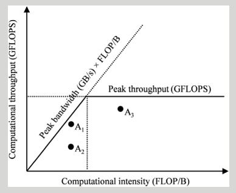

*Points closer to the two lines indicate that the algorithm is using compute and memory bandwidth efficiently.* 

### Memory types

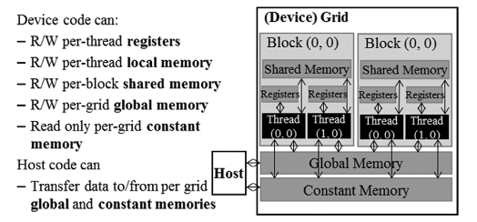
*A simple overview of the CUDA device memory model*

- The best case, of course, is when the memory is already in the registers. To be specific, advantages include much faster access times (and higher access bandwidth), and memory efficiency. Registers are on the processor chip, and you don't need any further memory load instructions, etc to perform your operation (say an ADD operation). 
- Shared memory: This is a form of *scratchpad memory*. Memory is still on-chip, but of course this has longer latency and lower bandwidth than registers. (at the level of L1 cache)
- A key feature of shared memory is that variables stored in shared memory are accessible by all threads in a block. 

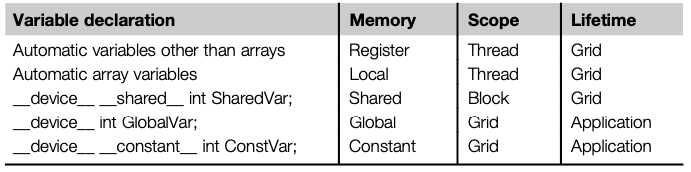
*Type qualifiers for different types of memory in CUDA*

- Constant variables are stored in the global memory but are cached for efficient access. If multiple kernel calls in your CUDA code use the same set of variables, it's a good idea to qualify them with `__constant__` for better access times.

### Tiling
- A fundamental pattern in CUDA code: operating on tiles of your inputs can be faster since you can save said tiles in shared memory (if you could, you'd put everything in shared memory, but you don't have much of this).
- Matrix multiplication can be written in a block-wise fashion to take advantage of tiling.

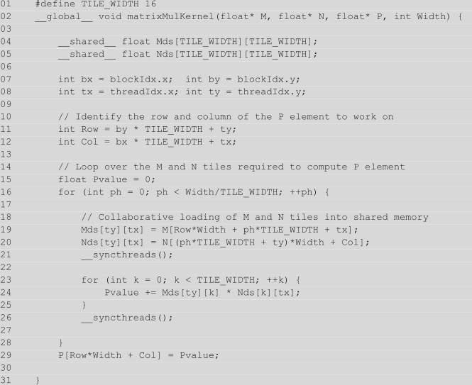  
*Tiled matrix mutiplication kernel. Automatic variables like bx, by, tx and ty are stored in registers. That's one copy per thread! The core of the algorithm is the for loop. Each block of threads performs a partial matrix multiplication by loading TILE_WIDTH x TILE_WIDTH blocks of M and N into shared memory, one-by-one.*

- Interestingly, there are two `__syncthreads()` operations in the kernel. The first one in line 21 is obvious. In Line 26, it is added because we don't want any one thread to move onto the next iteration and corrupt the current values in shared memory that some other thread is still using.
- With WxW tiling, you reduce the number of global memory accesses by W. This is because each row of M and each column of N is now accessed only once instead of W times.
- There are some additional boundary conditions needed in line 19 and 20 to handle general matrix dimensions.

### Memory usage and occupancy
- The amount of on-chip memory -registers, shared memory needed per thread can impact occupancy. 
- For an A100, you get about 164KB of shared memory per SM with a maximum of 2048 threads per SM. This means a maximum of 82 B of shared memory per thread 
- In the tiled matmul example, each thread uses 4 B + 4B = 8B of shared memory, one for each element of M and N it loads.
- THe size of the shared memory matrices can be dynamically changed (here it was the constant TILE_WIDTH) by using the `extern` keyword.

## Chapter 6: Performance Considerations
### Memory coalescing
- The global memory of a CUDA device is implemented with DRAM. Data bits are stored in DRAM cells that are small capacitors, in which the presence or absence of a tiny amount of electrical charge distinguishes between a 1 and a 0 value. 
- DRAM memory access takes tens of nanoseconds per bit, much slower than the subnanosecond clock speed of modern processors. 
- DRAM can hide some of this latency with parallel data access i.e memory access throughput. (*DRAM bursting*)
- DRAM memory access speeds can be better if you use a larger capacitor, but, over the years, we've wanted to pack more bits per chip, so the sizes have only gotten smaller. Thus, memory latency hasn't improved much.
- In CUDA devices, when threads in a warp want to access memory, the hardware detects whether they are accessing consecutive memory locations. In this case, the hardware combines, or coalesces, all these accesses into a single, consolidated access to consecutive DRAM locations. 
- Strategies to achieve memory coalescing:  
    a. Rearrange how threads are mapped to data  
    b. Change the data layout itself  
    c. Transfer the data from global memory to shared memory. Carry out the unfavourable access pattern here, with lower latencies. (*Corner tuning*) 
### Hiding memory latency
- DRAMs go further for parallel memory access through banks and channels.
- A processor consists of one or more channels. Each channel is a memory controller with a bus that connects a set of DRAM banks to the processor.
- Each bus has a data transfer rate determined by its width and clock frequency. *Double Data Rate(DDR)* busses perform two mem accesses per clock cycle (one at the falling edge, one at the rising edge). For example, a 64-bit DDR bus with 1GHz clock frequency can support rates of 8*2 = 16GB/sec.
- Each bus is an array of DRAM cells (along with sensing amplifiers for these cells, etc).
- Each DRAM access involves long latency for the decoder to enable the cells and for the cells to share their stored charge with the sensing amplifier. 

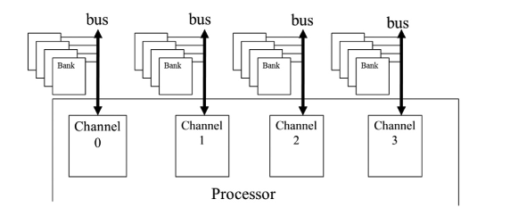  
*An example DRAM system with 4 channels with 4 banks per channel. Each bank is an array of DRAM cells that one can access.*

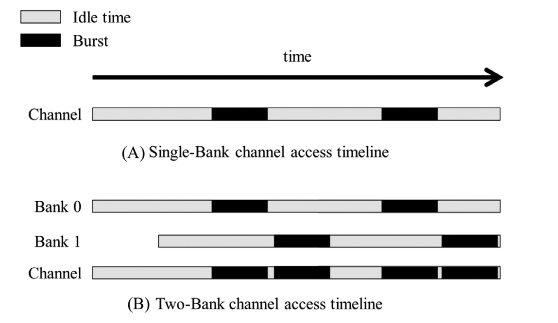  
*An excellent visualization for banking. In Figure (A), we have onely one bank, with long idle times between burts. In Figure (B), we have multiple banks per channel, with bursts and idle time of different banks overlapped. Recall that the idle times between consecutive DRAM accesses are unavoidable.*

- The ratio of the memory access latency and the data transfer rate can be large, like 20: 1. This means that the memory bus utilization is 1/21 = $4.8\\%$. This problem is solved by connecting multiple banks to a channel. To fully utilize the channel memory bus, we need 21 banks for the channel. More generally, if the ratio is R: 1, then the number of banks per channel needed is R+1.

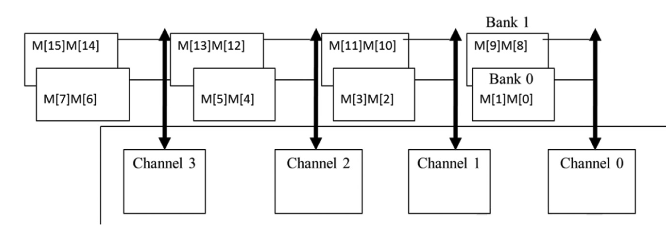  
*Array elements distributed into channels and banks. In this case, the array is stored in channels in groups of 8 bytes. Two successive 8-byte chunks are stored in different channels. Notice how a memory access for consecutive elements will spread across channels, thereby utilizing more of the available bandwidth.*

- DRAM burst size is the total number of bits you can access across all channels. The above memory layout will maximize utilization of the DRAM burst for accessing consecutive array positions.

### Thread coalescing
- There's always some price to pay with thread parallelism - redundant data loading, synchronization overhead, etc.
- Sometimes, it is better to *partially* serialize the work and reduce the price that is paid for parallelism. This can be done by assigning each thread multiple units of work, referred to as *thread coarsening*.
- A classic example where you can apply thread coarsening is matrix multiplication (say of M and N), where the same blocks of M are loaded by different threads to compute different output elements. If this loading is serial, then there is a price with parallelism (redundant long latency DRAM accesses)
- Two simple pitfalls to avoid with thread coarsening:
    - Applying to places where it doesn't make any sense - different thread units were already independent. For example vector addition.
    - Applying to too much coarsening such that the hardware resources are underutilized. 
- [TODO: Need a good toy example here for when coarsening can help]

### A checklist of optimizations
Nothing much to say apart from putting up the exact summary verbatim:
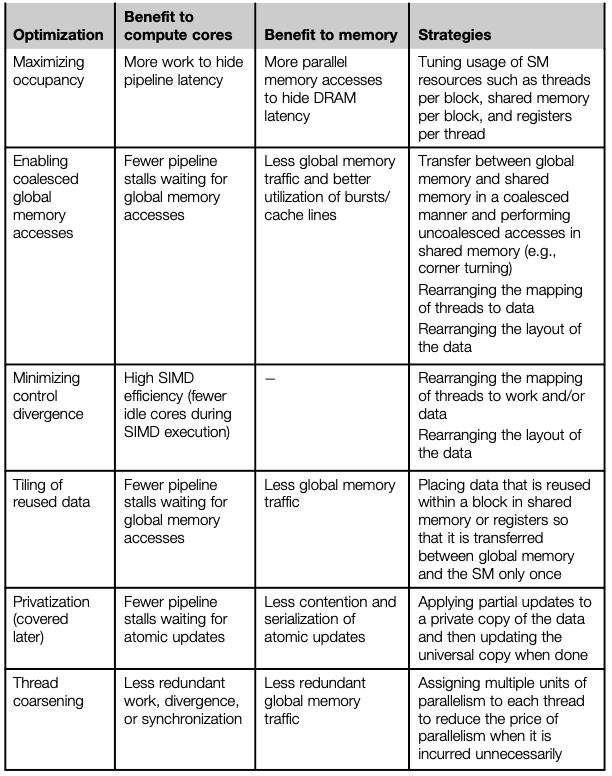

- [TODO: Based on algorithms in later chapters, add demonstrations of applying different optimizations]

## Chapter 7: Convolution
- Defining the convolution: A convolution between a  filter of radius $r$ , $f = [f_0, f_1, \dots, f_{2r}]$ and an input signal $x = [x_0, x_1, \dots, x_{n-1}]$  is defined as 
$$y_i = \displaystyle\sum_{j=-r}^{r}{f_{i+j}x_i}$$

- Boundary cases: zero padding ("ghost cells")
- Assume for simplicity here that the input and output have the same dimensions.

### A simple convolution kernel

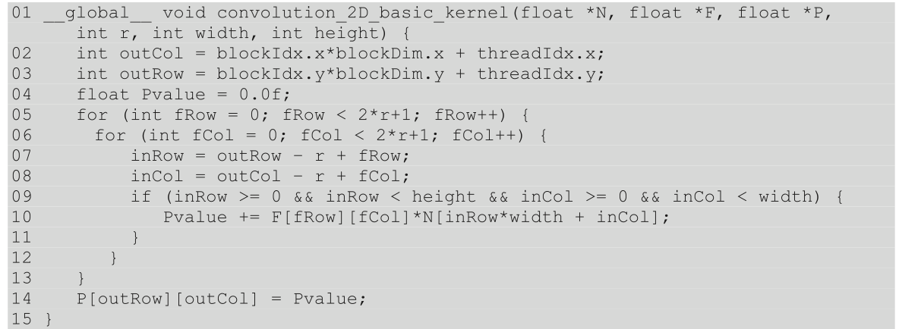
- Similar to the matmul, this has an arithmetic intensity of 0.25 OP/B.

### Caching
- The filter $F$ in the code above is used by all the threads in the grid and also remains constant throughout the kernel execution. 
-  This can thus be stored in constant memory and cached for later accesses. Recall the device memory mode: constant memory is available per-grid and is essentially a section in DRAM. This increases the arithmetic intensity to 0.5 OP/B.
-  Declare a constant memory variable as :
`__constant__  <dtype> <var>`. This must be a *global* variable in the source file!. Use `cudaMemcpyToSymbol` to copy data into constant memory.
- Use the global variable in your kernel directly now:

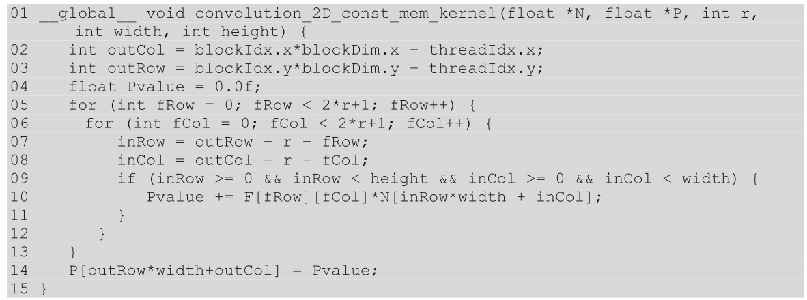
*2D Convolution kernel with the filter in constant memory. Almost all of the code is the same, the key difference is that $F$ is now a global variable*

- Caching with CUDA devices is "transparent" to programs (or maybe, opaque?). You don't have to worry about explicitly copying global memory variables into cache - the hardware will do this for you. 
-  As usual, the numbering convention for these cache levels reflects the distance to the processor. 

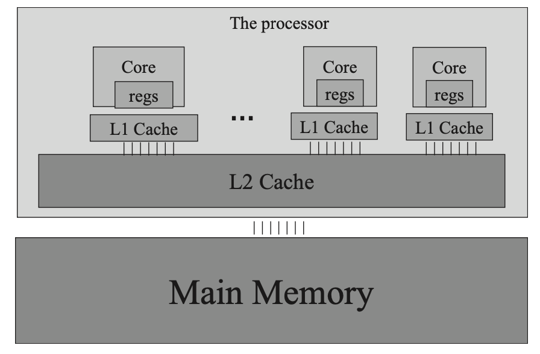

- An L1 cache is small, typically between 16 and 64 KB in capacity. L2 caches are larger, in the range of a few hundred kilobytes to a small number of MBs but can take tens of cycles to access.
- Modern GPUs have a specialized cache called the *constant cache*. This is designed specifically to support only reads, and is efficient in terms of area and power consumption.

### Tiled Convoution with Halo Cells
- When you add tiling for convolution, things are a bit more complicated because the input and output tile sizes are different. 
- If the filter radius is *r* (i.e filter size is $2r+1$) and the output tile size is $o_t$, the input tile is $o_t+2r$.

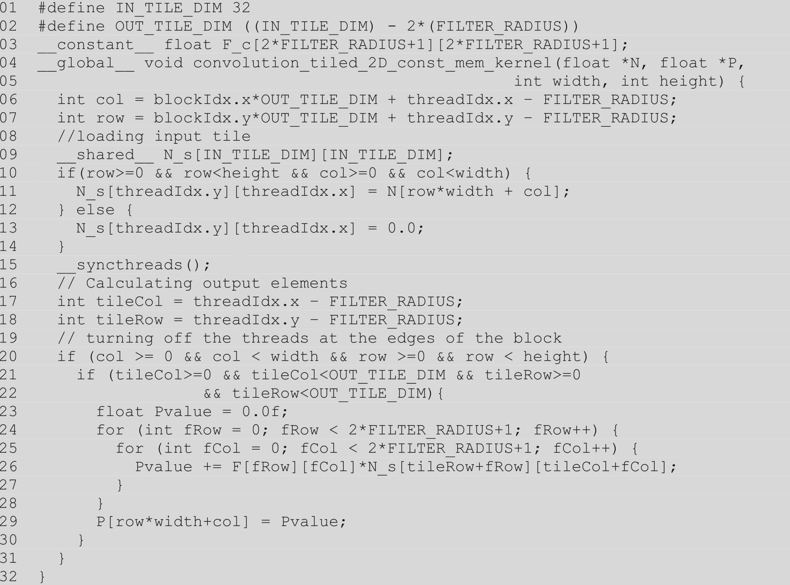
*Tiled 2D convolution kernel with filter in constant memory*

- The code can take a while to digest. One of the key things to note is that while block size is `IN_TILE_DIM`, the output `col` and `row` value handled by that thread are in multiples of `OUT_TILE_DIM`. This is precisely because of the differences in input and output tile sizes. Each output tile a tile of size `IN_TILE_DIM` > `OUT_TILE_DIM` in shared memory for perfoming the convolution. 
- Arithmetic intensity: Each thread block perfoms $2*(2r+1)$ operations per entry in the output tile, and thus performs a total of $\text{OUT\_TILE\_DIM}^2 (2r+1)*2$ FLOPs. We have $\text{IN\_TILE\_DIM}^2$ =  $(\text{OUT\_TILE\_DIM}+2r)^2 * 4$  bytes of global memory accesses per thread block. Thus, 

Arithmetic intensity = $\dfrac{\text{OUT\_TILE\_DIM}^2 (2r+1)*2}{(\text{OUT\_TILE\_DIM}+2r)^2 * 4}$

### Tiled convolution with caches 


*Tiled convolution algorithm with caching. Notice that the input and output tile size are the same*

- One can make sure of caching to reduce some of the complexity of dealing with halo cells in the previous section. In this case, each block will load inputs only in the `OUT_TILE_DIM` region into shared memory. For the halo cells, the idea is that neighbouring blocks might have already performed a global memory access to load these, and thus their values are already in the L2 cache.
- In the code above, you've got `IN_TILE_DIM=OUT_TILE_DIM=TILE_SIZE`. Notice that the halo cells are loaded directly from the array `N` instead of the shared memory array.