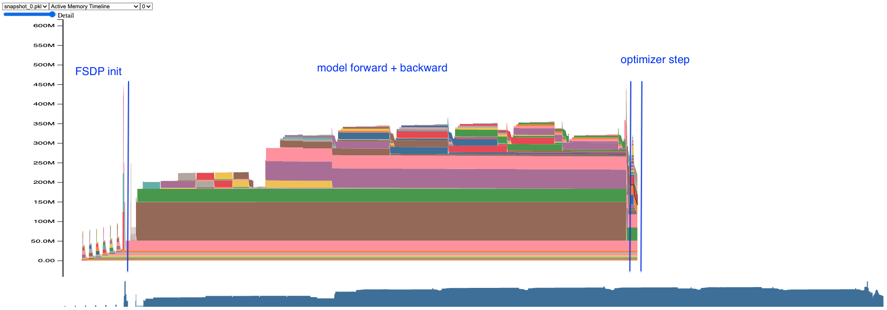
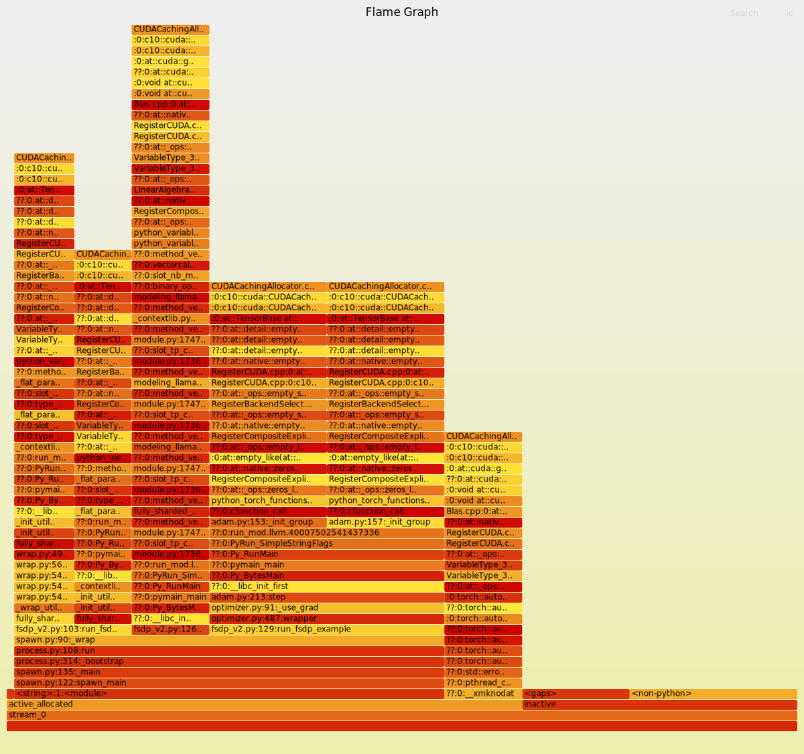

# Understanding CUDA Memory Usage


For the basic FSDP script below:

```python
torch.cuda.memory._record_memory_history(
        max_entries=MAX_NUM_OF_MEM_EVENTS_PER_SNAPSHOT
)
model = AutoModelForCausalLM.from_pretrained("BEE-spoke-data/smol_llama-101M-GQA")
model = FSDP(model, mixed_precision=MixedPrecision(param_dtype=torch.bfloat16, reduce_dtype=torch.bfloat16, buffer_dtype=torch.float32), wrapping_policy=transformer_wrap_policy)
model.train()
optimizer = torch.optim.Adam(model.parameters(), lr=0.1)
model(
    input_ids=torch.randint(0, 100, (1, 16), device="cuda")
).logits.mean().backward()
optimizer.step()
optimizer.zero_grad()
snapshot = torch.cuda.memory._snapshot()
with open("snapshot.pkl", "wb") as f:
    pickle.dump(snapshot, f)
```

The pickle file can be converted to a html file as:

```bash
python torch/cuda/_memory_viz.py trace_plot /path/to/snapshot.pkl -o snapshot.html
```

The pytorch memory snapshot is below:




Delineating different memory allocations in the memory timeline is not that simple - but you can do it by hovering over the memory allocations and looking at the stack trace to see which line of code is responsible. 

You can get a flame graph from the pickle file as follows:

```bash
python torch/cuda/_memory_viz.py memory /path/to/snapshot.pkl -o snapshot.svg
```

<object data="../assets/snapshot.svg" type="image/svg+xml" width="100%" height="500">
  
</object>

References:
- Debugging Pytorch Memory use with Snapshots: https://zdevito.github.io/2022/08/16/memory-snapshots.html 