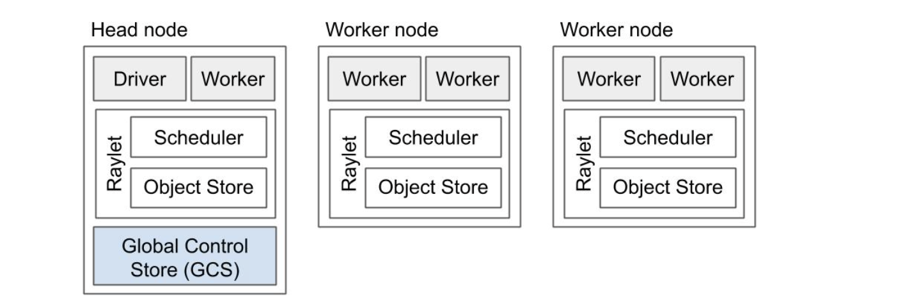
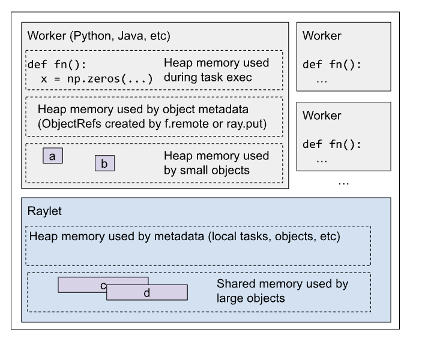
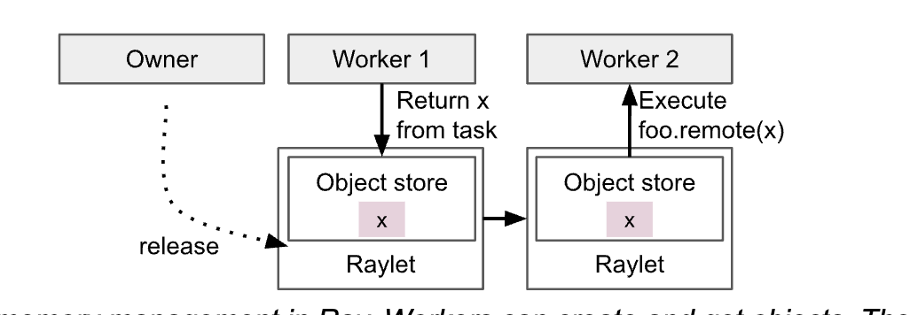

This is a summary of my learnings on Ray. A lot of the wordings here are borrowed verbatim from the [Ray architecture whitepaper](https://docs.google.com/document/d/1tBw9A4j62ruI5omIJbMxly-la5w4q_TjyJgJL_jN2fI/preview). There's really no greater resource than the document. I am also going through the Learning Ray book from Anyscale, which is good for applications but not for internals.

# Table of Contents

<!-- toc -->

- [The basics](#the-basics)
- [Major anti-pattern](#major-anti-pattern)
- [Actors](#actors)
  * [Execution](#execution)
  * [Failure Model](#failure-model)

<!-- tocstop -->

# The basics
- *Task* - A remote function invocation (an instance of a `@ray.remote` function). This is a single function invocation that executes on a process different from the caller, and potentially on a different machine. 
- *Object* - An application value. These are values that are returned by a task or created through `ray.put`. Objects are immutable! 
    - Ray also doesn't handle deduplication. More on this later.
- *Actor* - a stateful worker process (an instance of a `@ray.remote` class). Actor tasks must be submitted with a handle, or a Python reference to a specific instance of an actor, and can modify the actor’s internal state during execution.
    - An actor is still just another worker process! 
- Driver - The program root, or the “main” program. This is the code that runs `ray.init()`
    - TODO: What about a multi-node setup? I'm guessing ray.init is run only by the head node?
- Job - The collection of tasks, objects, and actors originating (recursively) from the same driver, and their runtime environment. There is a 1:1 mapping between drivers and jobs.
    - A job is a *collection*. It is not a single task/ function invocation. Each driver is executing a "job".
# Design
This part is pretty complicated at first glance. You can slowly start to see why this makes sense by going over more and more examples and applications of Ray. 

- Raylet: This is shared within a node! Notice how each node has one raylet, which has two components:
    - Scheduler: Responsible for resource management, task placement, and fulfilling task arguments that are stored in the distributed object store. (Basically, the scheduler in each node acts when new tasks are launched and object references are resolved/ derefenced)
    - Shared-memory object store: This is the shared object store between all workers in a node. This is where large objects get stored.

Ray, overall, has a distributed object store with a decentralized task scheduling system. (the big words come in because each node can do the thing on it's own/ has it's own thing)

# Memory model
To understand how things work here, it is probably better to get a quick refresher on memory allocation in Python and C++
## Quick Refersher for Python and C++
- In C++, all local variables are, by default, allocated on the stack (unless you use `malloc`).  Recall that each function gets it's own stack (the "stack frame") where it stores arguments, local variables and return addresses. The stack is LIFO memory.
- `malloc` is used for dynamically allocating memory. This is memory allocated on the heap. Heap memory has to be managed manually by the user (while stack memory is managed automatically with function returns/program exit). 
- Python manages memory with a private heap that stores all objects and data structures. This is not because Python is interpreted, by the way. There are optimizations you can do to avoid heap allocation by default, and you can read up on PostScript. But, in summary, Python's memory manager allocates all objects on the heap, and, instead of manual management by the user, we have Python's infamous garbage collector toiling behind the scenes to clean up our mess.
## Ray's memory model

There's a lot going on in the about picture. I frankly prefer the simple list of different memory components:
- <u>Heap memory used by Ray workers during task or actor execution</u>: This is, to simplify things a bit, like your regular Python memory management on the heap. Note that the user/ application developer needs to be mindful of excessive memory usage due to a large number of workers, etc.
- <u>Shared memory used by large Ray objects</u>: This is shared memory used when you do a `ray.put` call, or those returned by a Ray task!
    - **Important:** The return values of Ray tasks are stored in the object store. Contrast this with regular local memory that is used by a task, which gets allocated on the heap
    - **Garbage collection:** We were just discussing about garbage collection on heap/stack. Well, how does garbage collection work for Ray's shared memory object store? Ray does this for you via reference counts (much like Python's garbage collector)
- <u>Heap memory used by small Ray objects</u>: This is for objects returned by a Ray task! If the object is small enough, it will be stored in the heap memory of the "owner's" object store (ownership to be discussed soon: for now, just think of this as the object store local only to the worker that called/spawned this other worker).
- <u>Heap memory used by Ray metadata</u>:  This is memory allocated by Ray to manage metadata for the application. Memory for the GCS, for Raylet meta data, etc come under this category.

After reading all of this, go back to the image of the memory model. Things will make a lot more sense now :)

# Lifetime of a Task
The process that submits a task is considered to be the owner of the result and is responsible for acquiring resources from a raylet to execute the task.

let's say the Driver process submits Task A (gets taken up by a worker, Worker 1) which submits Task B (Worker 2). The Driver is the _owner_ for the result of Task A, and similarity Worker 1 is the owner for Task B.

The owner can pass normal Python objects as task arguments. If a task argument’s value is small, it is copied directly from the owner’s in-process object store into the task specification, where it can be referenced by the executing worker.

## Major anti-pattern: passing large values directly as arguments
If a task’s argument is large, the owner first calls `ray.put()` on the object under the hood - this stores the object in the object store, and the ObjectRef is passed automatically. Note that, if the same owner spawns 4 workers, and passed a huge argument in this fashion, you end up with 4 copies of the list! Ray does not perform deduplication on it's own! Thus, if you're spawing multiplel workers, put the argument in the object store and pass by reference!

# Lifetime of an Object

The owner of an object is the worker that created the initial `ObjectRef`, by submitting the creating task or calling `ray.put`.Each worker stores a ref count for the objects that it owns.

There are details on how Ray manages ObjectRefs but I believe these can be skipped since you won't be doing garbage collection yourself

Let's move to how these ObjectRef's are resolved (like dereferencing). There are two ways:
- Calling `ray.get` on an ObjectRef
- Passing an `ObjectRef` as an argument to a task.

An interesting caveat:
> Note that if the `ObjectRef` is contained within a data structure (e.g., Python list), or otherwise serialized within an argument, it will not be resolved. This allows passing references through tasks without blocking on their resolution.

TODO: Investigate the caveat and add an example

# Actors
When an actor is created in Python, the creating worker builds a special task known as an actor creation task that runs the actor’s Python constructor.

All actor data is centrally stored and managed by the GCS service. 
Actor creation is non-blocking - the Python call to create the actor immediately returns an “actor handle” that can be used even if the actor creation task has not yet been scheduled

## Execution
Similar to tasks, they return futures, are submitted directly to the actor process via gRPC, and will not run until all `ObjectRef` dependencies have been resolved. 
- For each caller of an actor, the tasks are executed in the same order that they are submitted. This is because the tasks are assumed to modify the actor state.
- Ray provides `async actors` if you want actor tasks to be run concurrently

## Failure Model
- All nodes are assigned a unique identifier and communicate with each other through heartbeats.

